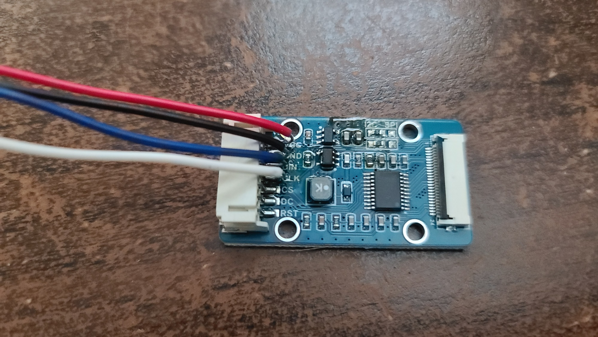

# Where have the updates been?
To put it simply, life got in the way. Competitions, a long-planned vacation followed by helping out family and an emergency hospitalization. All over the course of two months.

And that takes us to now.

To begin, a brief apology for the lateness.

And to begin the *next* part, did you know that the Raspberry Pi Pico has *two* cores?

# Dual cores and (a lack of a) transparent OLED
Originally upon returning to this project, I intended to start things off by trying to interface with the *SSD1309*, a different OLED display than the SSD1306 that we have currently been using. Unlike the '1306, the '1309 is a larger, transparent panel.

And in the chaos of the time between the beginning of May and now, I somehow managed to lose the cable before I'd even tested the thing out for the first time.

